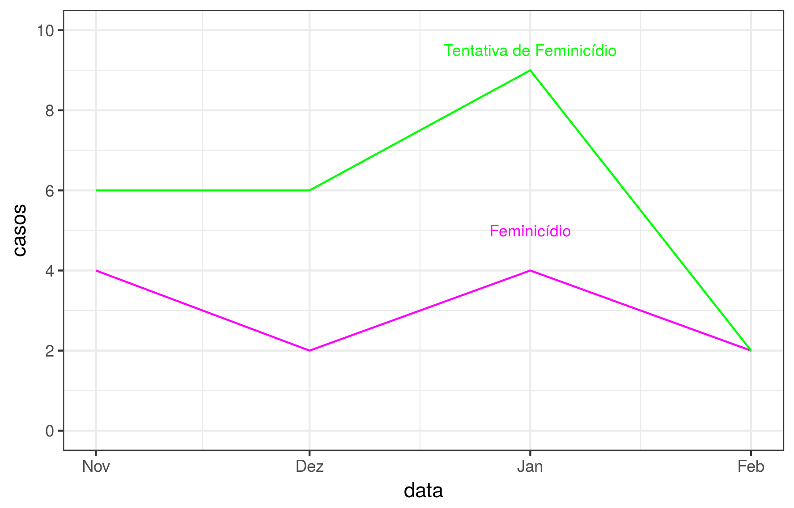
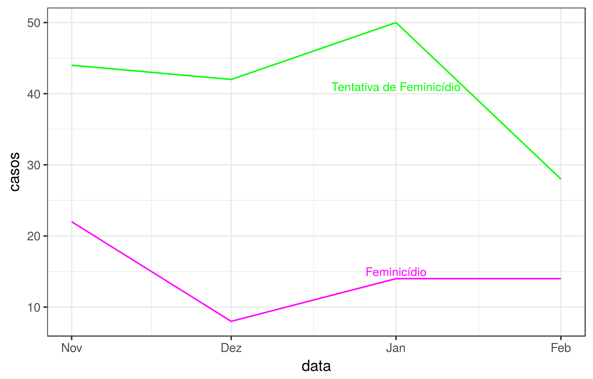

# 2017.04--Feminicidio--RJ

# Total de Feminicídios e de Tentativas de Feminicídios Ocorridos no Municipio do Rio de Janeiro

## Analise
#### [Quantas mulheres são mortas no Rio de Janeiro pelo simples fato de serem mulheres?]

Em 09 de Março de 2015 entrou em vigor a lei 13.104 que alterava o código penal brasileiro, criando uma nova modalidade para homicídio qualificado: o feminicídio. Entende-se por feminicídio os crimes contra a vida por a) razões da condição do sexo feminino, b) violência doméstica e c) menosprezo ou discriminação à  condição de mulher. Na mesma linha, a Assembléia Legislativa do Estado do Rio sancionou em 2016 a lei 7448, que obriga a inclusão dos dados referentes ao feminicídio no banco de dados da polícia. 

Segundo a Organização Mundial da Saúde, o Brasil possuí a quinta maior taxa de feminicídios do mundo. Em 2015, de acordo com o Instituto de Segurança Pública, 360 mulheres foram vítimas de feminicídio no Estado do Rio de Janeiro. O que não tem nome no existe. A tipificação do crime contra mulher se faz necessária para expor os traços da sociedade extramamente machista que vivemos e levantar o debate sobre a relação desigual de poder entre gêneros ainda presente nos dias de hoje. 

O DATA BASE propõe-se a atualizar mensalmente os dados sobre feminicídios e tentativas de feminicídios na cidade do Rio de Janeiro.   

Período: 4 meses. nov 2016 - fev 2017

Total tentativas e mortes no Estado: 22
Total tentativas e mortes na Cidade: 35

###### Série Temporal dos Feminicídios e de Tentativas de Feminicídios

cidade

estado

## Metodologia

Os dados foram pre-processados e visualizados em R. 
O script usado está disponível [aqui](https://github.com/database-RJ/Feminicidio---RJ/blob/master/feminicidio.R).

## Fonte

ISP - Instituto de Segurança Pública (http://www.isp.rj.gov.br/Conteudo.asp?ident=174)
